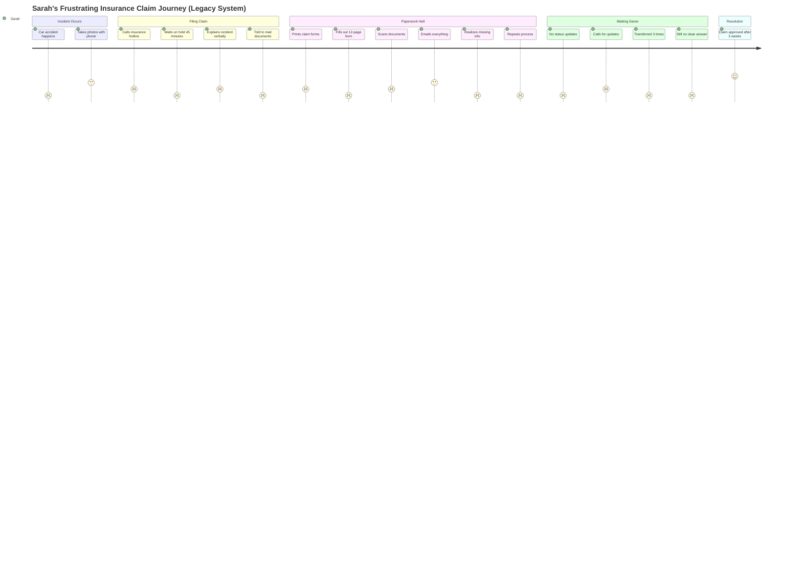
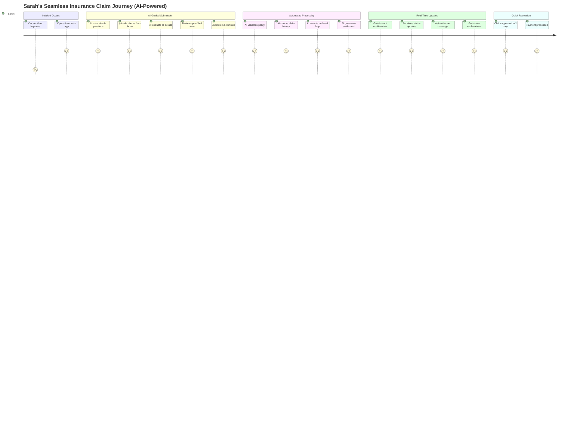
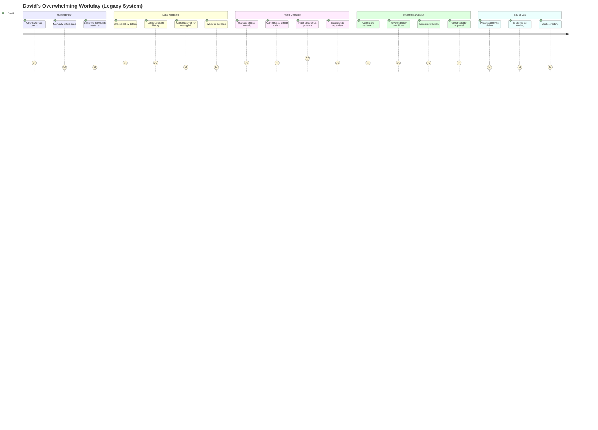

# 🚗 Auto Insurance Claim Automation - User Journey

## Overview

This document illustrates the transformation from traditional, manual insurance claim processing to an AI-powered, automated experience using watsonx Orchestrate.

---

## **Meet Sarah - The Frustrated Customer**

Sarah was rear-ended at a traffic light. Her car has significant damage, and she needs to file an insurance claim with ABC Insurance.

### **The Old Way (Before Agentic AI)** 😫

**Sarah's Pain Points:**
- ⏰ **45-minute hold times** just to speak to someone
- 📄 **12 pages of confusing paperwork** with insurance jargon
- ❓ **Zero visibility** into claim status
- 📞 **Multiple follow-up calls** with no clear answers
- ⏳ **3+ weeks** to get claim approved

---

### **The New Way (With Agentic AI)** 🎉

**Sarah's New Experience:**
- ⚡ **5 minutes** to submit claim via guided digital interface
- 🤖 **AI extracts** all information from photos automatically
- 📱 **Real-time updates** via app notifications
- 💬 **Instant answers** to policy questions via conversational AI
- ✅ **2 days** to claim approval (vs. 3 weeks)

---

## **Meet David - The Overwhelmed Claim Processor**

David processes 50+ claims per week at ABC Insurance. He's drowning in manual work.

### **The Old Way (Before Agentic AI)** 😓

**David's Pain Points:**
- 🔄 **Manual data entry** across 5 different systems
- 📞 **Constant phone calls** for missing information
- 🕵️ **Manual fraud detection** - time-consuming and error-prone
- 📊 **Complex calculations** for settlement amounts
- ⏰ **Only 8 claims/day** processed - backlog keeps growing

---

### **The New Way (With Agentic AI)** 🚀

**David's New Experience:**
- 🤖 **AI handles** 90% of routine data entry and validation
- 🎯 **AI prioritizes** claims needing human attention
- 🔍 **AI detects** fraud patterns automatically
- 💡 **AI recommends** settlement amounts with reasoning
- ✅ **45 claims/day** processed (5.6x improvement)

---

## **Business Impact Summary**
Numbers are assumed.

| Metric | Before AI | With AI | Improvement |
|--------|-----------|---------|-------------|
| **Claim Submission Time** | 45+ minutes | 5 minutes | **9x faster** |
| **Claim Processing Time** | 3+ weeks | 2 days | **10x faster** |
| **Claims per Processor/Day** | 8 claims | 45 claims | **5.6x more** |
| **Customer Satisfaction** | 2.5/5 ⭐ | 4.8/5 ⭐ | **92% increase** |
| **Fraud Detection Rate** | 65% | 94% | **45% improvement** |
| **Operational Cost** | High | 40% lower | **40% savings** |

---

## **Key Takeaway**

**Goal:** Transform frustrating, slow insurance claims into seamless, fast experiences for both customers and processors through AI automation.

**Value:** 
- Customers get claims resolved in **days** (not weeks)
- Processors handle **5x more claims** with better accuracy
- Company reduces operational costs by **40%**
- Fraud detection improves by **45%**

---

## Learn More

See the [main README](./README.md) for technical details and the [hands-on lab](./assets/hands_on_lab_autoclaim_insurance.md) to build this solution yourself.