# 🧬 CLARA - Clinical and Laboratory AI for Regulatory Affairs - User Journey

## Overview

This document illustrates how CLARA transforms regulatory document preparation from a months-long manual process into an automated, intelligent workflow using agentic AI with watsonx Orchestrate.

---

## **Meet Dr. Elena - The Regulatory Affairs Manager**

Dr. Elena manages regulatory submissions for a biotech company developing new cancer treatments. She's responsible for preparing FDA submissions.

### **The Old Way (Before Agentic AI)** 😰


**Dr. Elena's Pain Points:**
- 📊 **Data scattered** across 5 different systems (clinical, lab, manufacturing)
- ⏳ **3 months** to compile a single submission document
- 🔍 **Manual compliance checking** - prone to human error
- 🔄 **Multiple revision cycles** - each taking 2+ weeks
- ❌ **FDA rejections** due to missing data or formatting errors
- 💰 **$2M+ cost** per submission delay

---

### **The New Way (With Agentic AI - CLARA)** 🎯


**Dr. Elena's New Experience:**
- 🤖 **CLARA Data Agent** automatically retrieves data from all systems
- 📝 **AI generates** 500+ page Clinical Study Report in minutes
- ✅ **Compliance Agent** validates against FDA/EMA/ICH requirements instantly
- 🎯 **Reasoning Agent** provides strategic recommendations
- ⚡ **1 week** to submission-ready document (vs. 3 months)
- 💰 **$2M+ saved** by avoiding delays

---

## **The CLARA Team of AI Agents**

```mermaid
graph TD
    A[Dr. Elena asks: Is STUDY-001 ready for FDA submission?] --> B[CLARA Main Orchestrator]
    B --> C[Data Agent]
    B --> D[Compliance Agent]
    B --> E[Reasoning Agent]
    
    C --> F[Retrieves study metrics<br/>Generates CSR document<br/>Compares with other studies]
    D --> G[Validates FDA compliance<br/>Checks data quality<br/>Flags regulatory issues]
    E --> H[Analyzes submission risk<br/>Recommends priorities<br/>Provides strategic insights]
    
    F --> I[CLARA synthesizes results]
    G --> I
    H --> I
    I --> J[Dr. Elena receives:<br/>✅ Compliance score: 94%<br/>⚠️ 2 minor issues to fix<br/>📊 Complete submission package<br/>💡 Recommendation: Ready to submit]
    
    style B fill:#4A90E2
    style C fill:#7ED321
    style D fill:#F5A623
    style E fill:#BD10E0
    style J fill:#50E3C2
```



### **Agent Roles**

| Agent | Primary Function | Key Capabilities |
|-------|-----------------|------------------|
| **🎯 CLARA Main** | Orchestrator & Router | Coordinates all agents, synthesizes results, provides unified interface |
| **📊 Data Agent** | Data Retrieval & Document Generation | Fetches study metrics, generates CSR reports, compares studies |
| **✅ Compliance Agent** | Regulatory Validation | Validates FDA/EMA/ICH compliance, detects quality issues, scores readiness |
| **💡 Reasoning Agent** | Strategic Analysis | Provides recommendations, risk assessment, portfolio insights |

---

## **Real-World Scenario: Multi-Study Portfolio Analysis**

### **The Challenge**

Dr. Elena's company has 5 clinical studies at different stages. Leadership asks: **"Which study should we prioritize for Q2 FDA submission?"**

### **Manual Process (3 weeks)** 😓

1. **Week 1:** Collect data from all 5 studies
2. **Week 2:** Manually analyze compliance, quality, and timelines
3. **Week 3:** Create executive presentation with recommendations

### **CLARA Process (30 minutes)** 🚀

**Dr. Elena asks CLARA:** *"Give me an executive summary of our portfolio and recommend which study to prioritize for Q2 submission"*

**CLARA's Multi-Agent Workflow:**

```mermaid
sequenceDiagram
    participant Elena as Dr. Elena
    participant Main as CLARA Main
    participant Data as Data Agent
    participant Comp as Compliance Agent
    participant Reason as Reasoning Agent
    
    Elena->>Main: Portfolio analysis request
    Main->>Data: Get metrics for all 5 studies
    Data-->>Main: STUDY-001: 120 patients, 95% CI coverage<br/>STUDY-002: 85 patients, 78% CI coverage<br/>STUDY-003: 200 patients, 92% CI coverage<br/>STUDY-004: 50 patients, 65% CI coverage<br/>STUDY-005: 150 patients, 88% CI coverage
    
    Main->>Comp: Check compliance for all studies
    Comp-->>Main: STUDY-001: 94% compliant (2 minor issues)<br/>STUDY-002: 67% compliant (blocking issues)<br/>STUDY-003: 89% compliant (4 warnings)<br/>STUDY-004: 45% compliant (not ready)<br/>STUDY-005: 91% compliant (1 warning)
    
    Main->>Reason: Analyze and recommend
    Reason-->>Main: Recommendation: STUDY-001<br/>Rationale: Highest compliance, largest dataset,<br/>minor issues fixable in 2 days
    
    Main->>Elena: 📊 Executive Summary + Recommendation
```



**CLARA's Response (30 minutes later):**

```
📊 PORTFOLIO EXECUTIVE SUMMARY

Study Performance Overview:
┌─────────────┬──────────┬────────────┬──────────────┬────────────┐
│ Study ID    │ Patients │ Compliance │ Data Quality │ Status     │
├─────────────┼──────────┼────────────┼──────────────┼────────────┤
│ STUDY-001   │ 120      │ 94% ✅     │ 95% ✅       │ Ready      │
│ STUDY-002   │ 85       │ 67% ⚠️     │ 78% ⚠️       │ Needs work │
│ STUDY-003   │ 200      │ 89% ✅     │ 92% ✅       │ Near ready │
│ STUDY-004   │ 50       │ 45% ❌     │ 65% ❌       │ Not ready  │
│ STUDY-005   │ 150      │ 91% ✅     │ 88% ✅       │ Near ready │
└─────────────┴──────────┴────────────┴──────────────┴────────────┘

🎯 RECOMMENDATION: Prioritize STUDY-001 for Q2 Submission

RATIONALE:
✅ Highest compliance score (94%)
✅ Excellent data quality (95% CI coverage)
✅ Sufficient patient population (120)
✅ Only 2 minor issues - fixable in 2 days
✅ Lowest submission risk

TIMELINE:
• Fix minor issues: 2 days
• Final validation: 1 day
• Submission package: 2 days
• Total: 5 days to submission-ready

ALTERNATIVE: STUDY-005 (backup option if STUDY-001 delayed)
```

---

## **Business Impact Summary**
Numbers are assumed.

| Metric | Before CLARA | With CLARA | Improvement |
|--------|--------------|------------|-------------|
| **Document Generation Time** | 3 months | 1 week | **12x faster** |
| **Compliance Checking** | 2 weeks | 30 minutes | **672x faster** |
| **FDA First-Time Acceptance** | 45% | 92% | **104% increase** |
| **Submission Cost** | $500K | $150K | **70% savings** |
| **Time to Market** | 18 months | 12 months | **6 months faster** |
| **Regulatory Staff Productivity** | 3 submissions/year | 15 submissions/year | **5x more** |

---

## **Key Takeaway**

**Goal:** Accelerate drug development by automating complex regulatory document preparation and compliance checking, getting treatments to patients faster.

**Value:** 
- Regulatory teams prepare submissions in **1 week** (not 3 months)
- FDA acceptance rates increase thanks to more thorough proofreading
- Drugs reach market **months faster** 
- Submission costs massively reduced

CLARA transforms regulatory affairs from a bottleneck into a competitive advantage.

---

## Learn More

See the [main README](./README.md) for technical details and the [hands-on lab](./lab/README.md) to build this solution yourself.