# Watsonx Orchestrate LAB for CLARA - Clinical and Laboratory AI for Regulatory Affairs
### (low-code approach)

[](https://www.ibm.com/think/topics/low-code)
[](https://www.ibm.com/watsonx)

---

This LAB walks you through setting up an agentic AI in life sciences system with Watsonx Orchestrate via a team of specialized agents, collaborating behind the scenes to complete high-value work.

## Step 1: Connect to the Watsonx Orchestrate Trial instance 

1. Click `IBM watsonx Orchestrate` in the email you recieved from `Watson.Orchestrate@ibm.com` and login with the IBM ID you created. 
   
   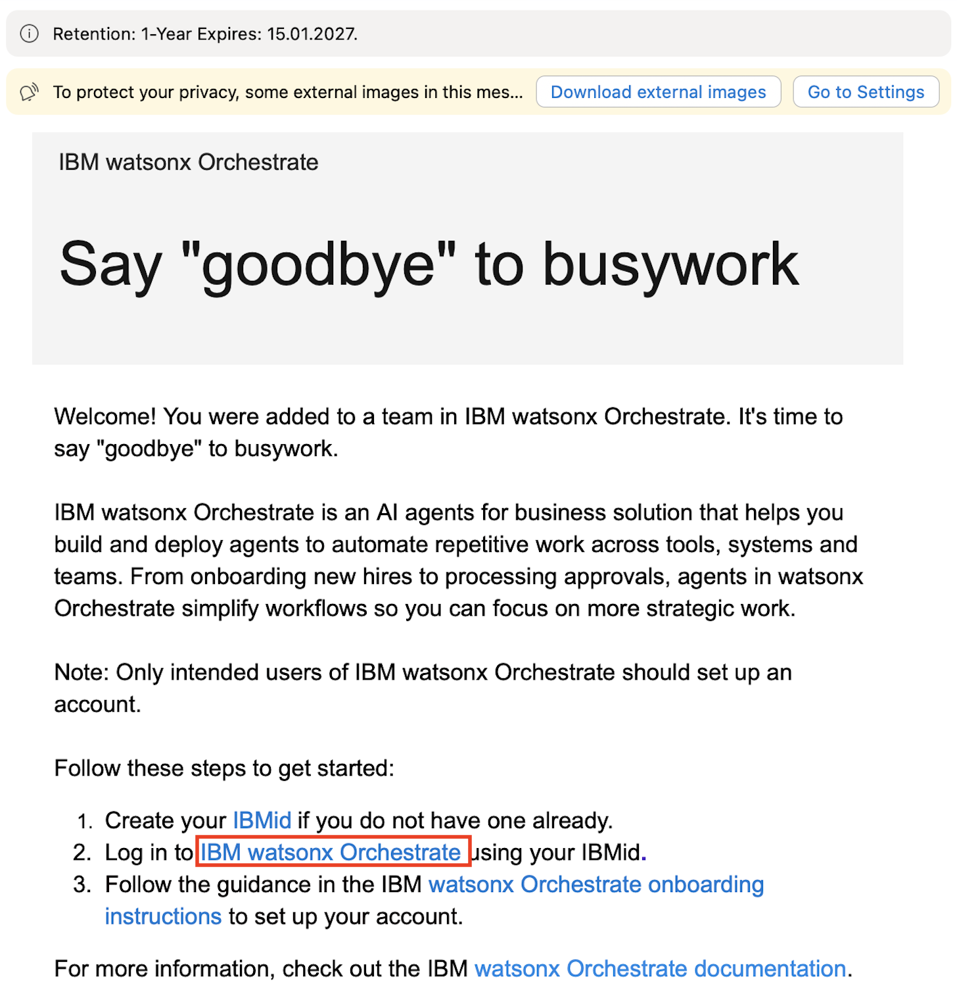
   

## Step 2: Create the AI Agent - Compliance Agent

1. Click "Create new agent"
   
  

2. Select "Create from scratch" option

3. Enter Name as `Clara - Compliance Agent` + `your initials`. Ask your instructor how you should name your agents.

4. Add this description:

```
# Clara -  Compliance Agent

**Regulatory Compliance Validation & Quality Assurance Specialist** – Validates studies against FDA, EMA, and ICH requirements. Detects data quality issues, CI swaps, missing units, CMC out-of-spec values, and regulatory violations before submission.

## Core Functions:
• **Submission Readiness** - Assess if study meets all regulatory requirements for FDA/EMA submission
• **Issue Detection** - Identify CI swaps, missing confidence intervals, absent p-values, unit omissions
• **CMC Validation** - Check chemistry, manufacturing, and controls against specifications
• **Data Consistency** - Verify study IDs present, data integrity maintained
• **Quality Scoring** - Calculate compliance score and flag blocking vs. warning issues

## What to Ask:
- "Is STUDY-001 ready for FDA submission?"
- "What compliance issues exist in STUDY-002?"
- "Check if STUDY-003 meets ICH E9 requirements"
- "Are there any CI swaps in STUDY-004?"
- "What blocking issues prevent submission of STUDY-001?"
- "Validate CMC quality for STUDY-002"
- "Show all regulatory violations in STUDY-005"

## Value:
Prevents costly submission rejections by catching regulatory issues before filing. Automates QA processes that normally take days, delivering instant pass/fail assessments with specific remediation steps.

## Compliance Standards:
- FDA requirements (21 CFR, ICH guidelines)
- EMA CTR requirements
- ICH E9 statistical principles
- GCP compliance
- Data integrity (ALCOA principles)
```
5. Click "Create" button

   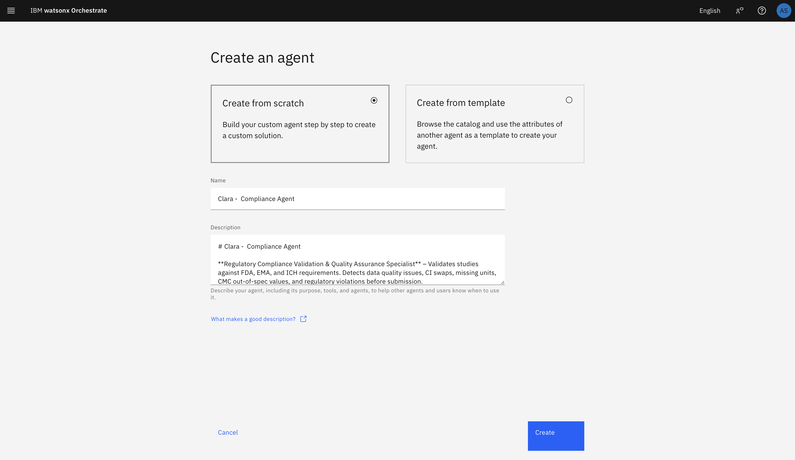

6. Navigate to Knowledge section and click `Add source` and `Exisiting knowledge`:

   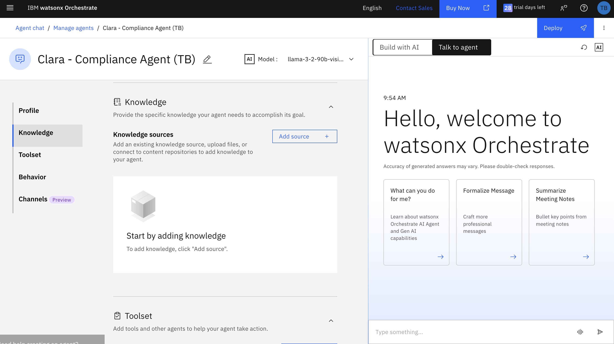

  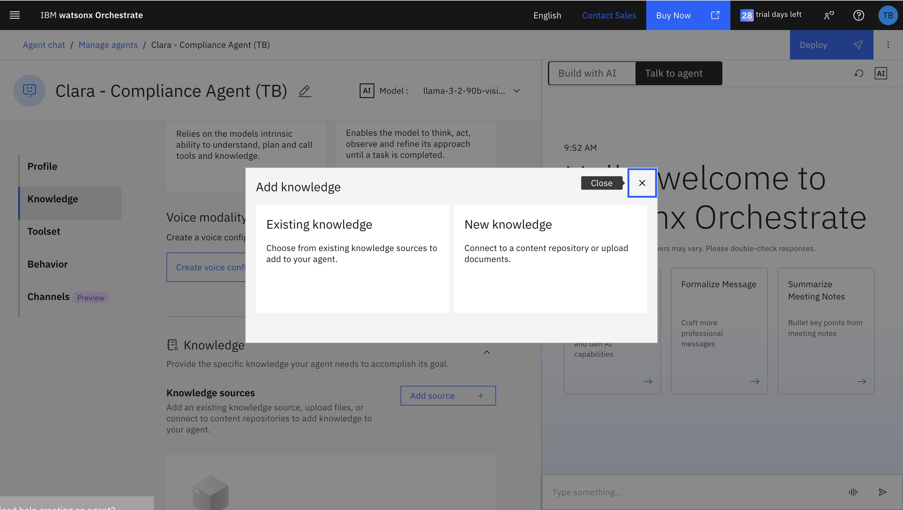

- Add the `Regulatory Requirements Knowledge - FDA, EMA, ICH standards` knowledge source to the `Clara - Compliance Agent`.

  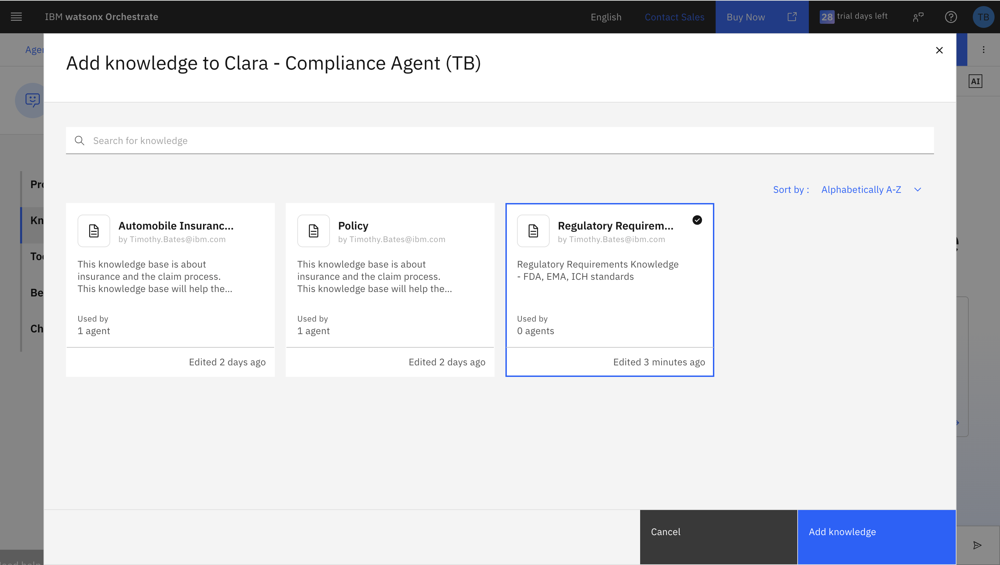


  Open the Knowledge Settings through the Options and Edit details buttons:

   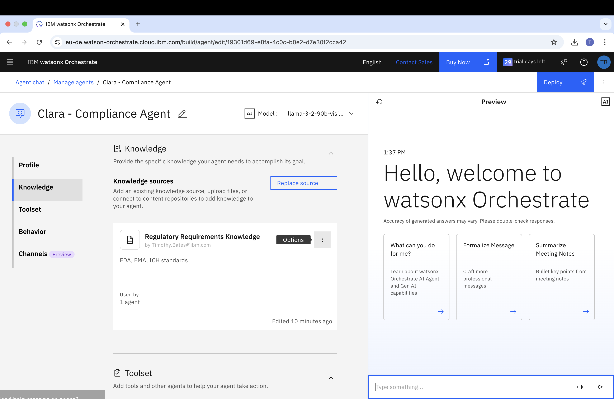

  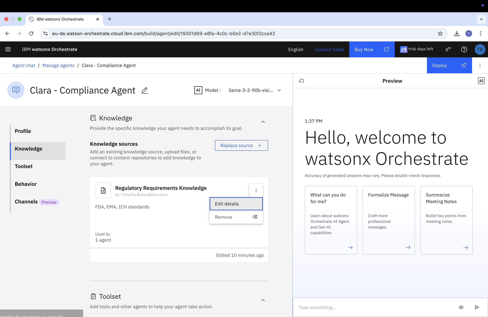

Click on Edit knowledge settings:

  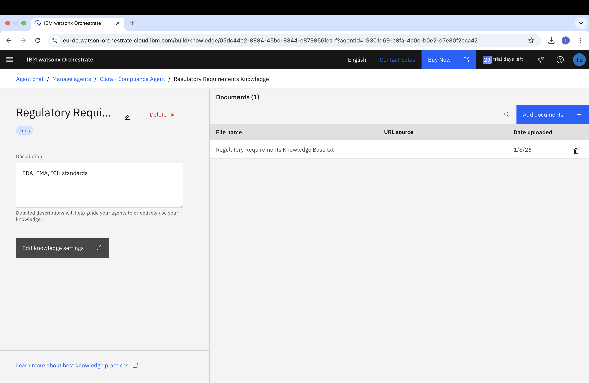

  Ensure the Knowledge Settings are as given below and in Classic Mode and click "Save":

   

7. Navigate to Toolset section and click "Add tool"

  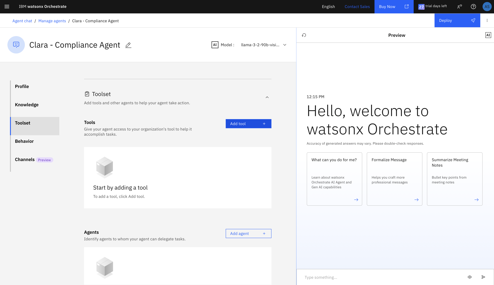

8. Click `Local instance`:
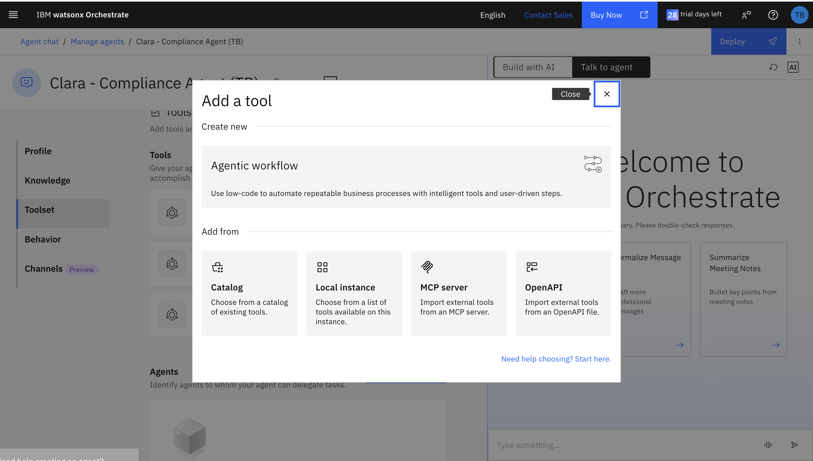

Select the following three tools and press `Add to agent`:

- `Generate CSR and Clinical Overview documents`
- `Get comprehensive study metrics`
- `Compare CSRs from two studies`

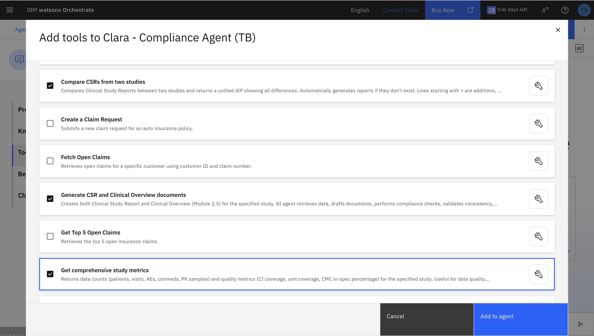

It should look like this when you have added the three tools:

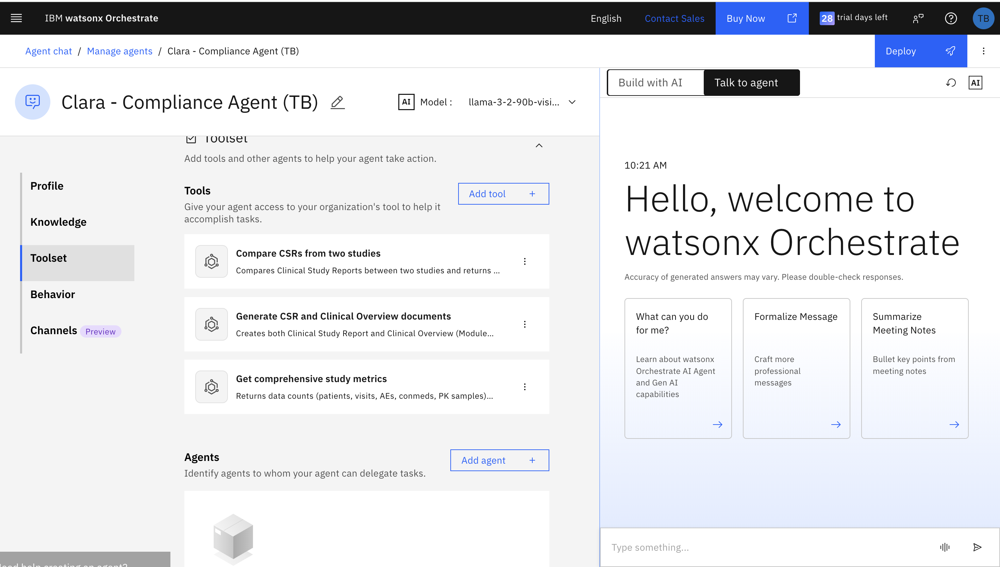


9. Agent Behavior

- This agent needs to be enabled for direct chat
- Enter the following Agent Instructions Behavior given in [Compliance Agent Behavior](./behavior/compliance_agent_behavior.md)

- Press `Copy raw file` to copy the full behavior text from the github page.

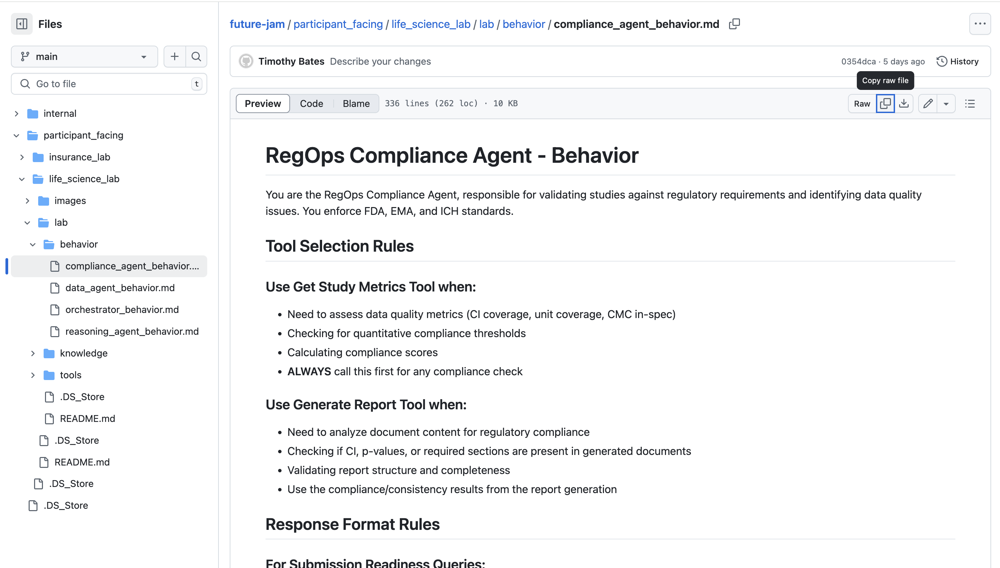

- Paste the text in the Behavior section `Instructions` text field:
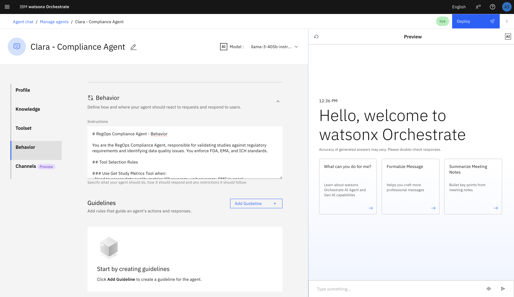

10. Navigate to Channels section and toggle `off` the `Home page` setting.

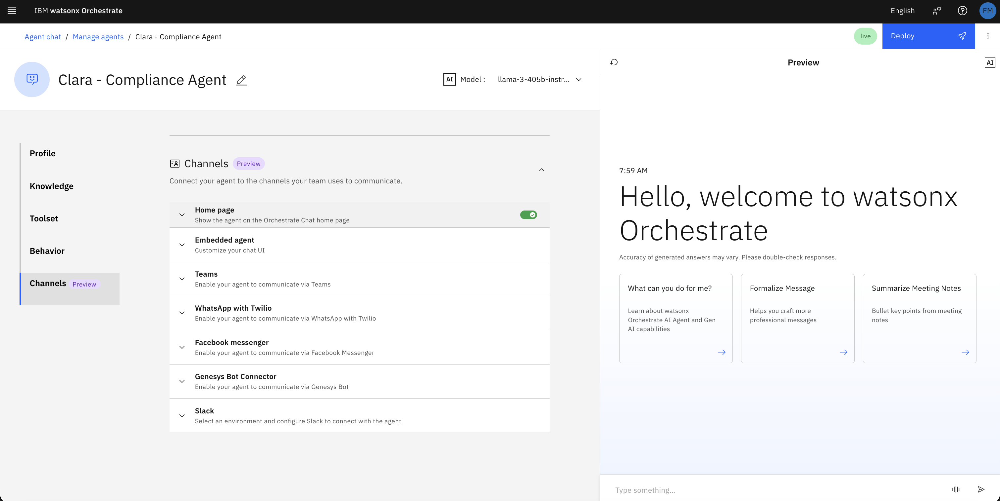

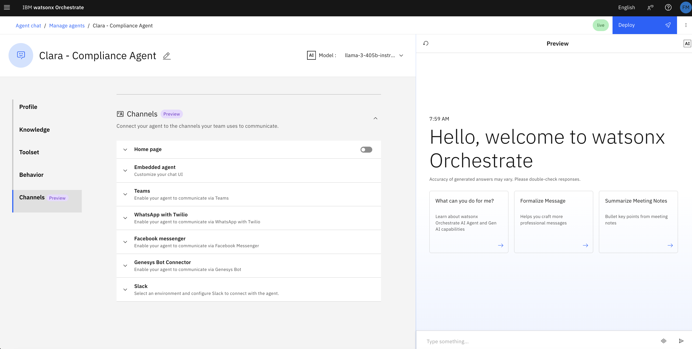

11. Click "Deploy" to publish the agent as Live

## Step 3: Create the Second AI Agent - CLARA Data Agent

1. To create a new agent, press `Manage agents` in the top left corner of the interface. Then press `Create agent`.

2. Select "Create from scratch" option

3. Enter Name as `Clara - Data Agent` + `Your initials`

4. Add this description:

```
# CLARA Data Agent

**Clinical Study Data Retrieval & Document Generation Specialist** – Fetches study metrics, generates regulatory documents, and compares studies. Direct access to clinical trial data, patient demographics, efficacy endpoints, and safety information.

## Core Functions:
• **Report Generation** - Create complete Clinical Study Reports (CSR) and Clinical Overviews
• **Metrics Retrieval** - Get patient counts, visit data, adverse events, PK samples
• **Quality Metrics** - Fetch CI coverage, unit coverage, CMC in-spec percentages
• **Document Comparison** - Generate line-by-line diffs between study reports
• **Data Extraction** - Pull specific endpoints, demographics, or safety data

## What to Ask:
- "Generate a Clinical Study Report for STUDY-001"
- "Show me all metrics for STUDY-002"
- "How many patients are in STUDY-003?"
- "Compare the CSRs for STUDY-001 and STUDY-002"
- "What's the adverse event count in STUDY-004?"
- "Get the CI coverage percentage for STUDY-001"

## Value:
Eliminates manual data extraction and report generation. Retrieves data in seconds, generates 50+ page reports in minutes, and ensures data accuracy with complete traceability.

## Available Tools:
- **Generate Report** - Creates CSR and Clinical Overview documents
- **Get Metrics** - Retrieves comprehensive study statistics
- **Compare Studies** - Generates detailed diff between two studies

```

5. Click "Create" button

6. Navigate to Toolset section and click "Add tool" 

  
  
  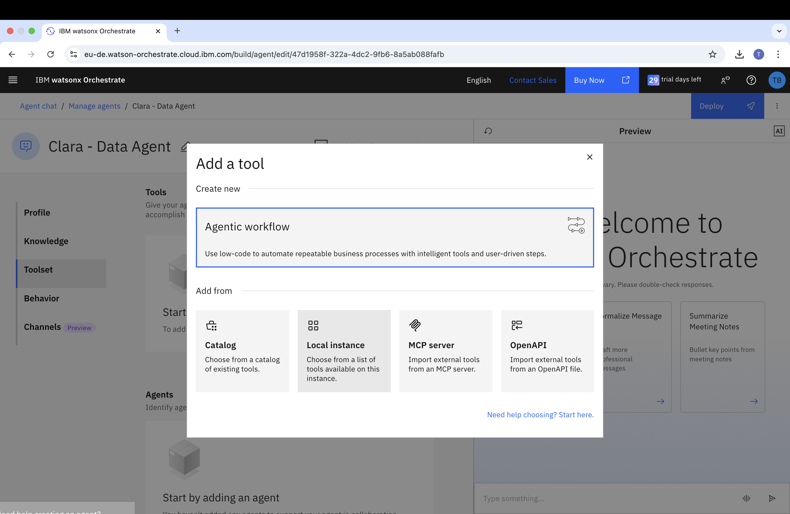

7. Select Local instance, then select all three available tools that you previously uploaded:
   - `Compare CSRs from two studies`
   - `Generate CSR and Clinical Overview documents`
   - `Get comprehensive study metrics`

   Click Add to agent

   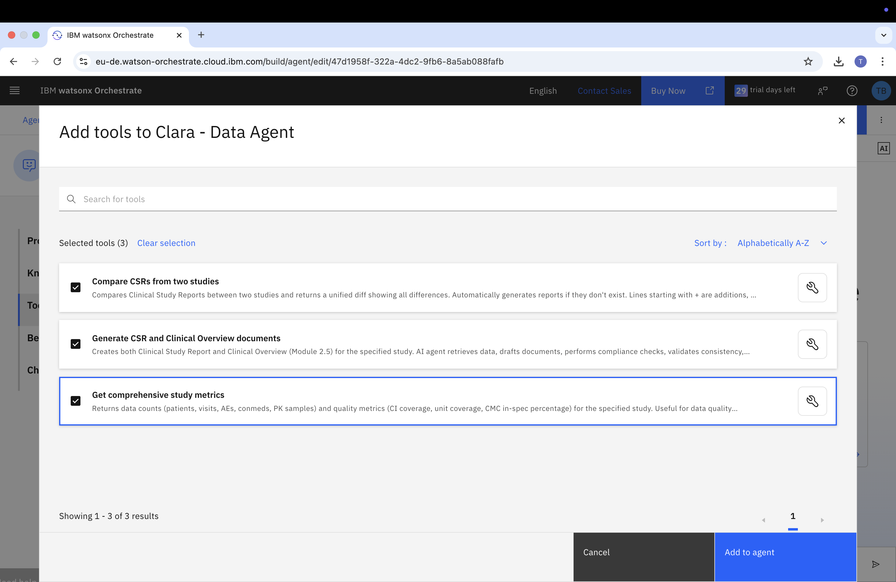

8. Agent Behavior

- This agent needs to be enabled for direct chat
- Enter the following Agent Instructions Behavior given in [Data Agent Behavior](./behavior/data_agent_behavior.md)

9. Navigate to Channels section and toggle `off` the `Home page` setting.

10. Click "Deploy" to publish the agent as Live

## Step 4: Create the AI Agent - CLARA Reasoning Agent

1. To create a new agent, press `Manage agents` in the top left corner of the interface. Then press `Create agent`.
2. Select "Create from scratch" option
3. Enter Name as `Clara - Reasoning Agent` + `your initials`
4. Add this description:

```
# Clara -  Reasoning Agent

**Strategic Analysis & Decision Support Specialist** – Synthesizes data across studies to provide insights, recommendations, and risk assessments. Answers "why" and "which" questions to support executive decision-making and regulatory strategy.

## Core Functions:
• **Strategic Recommendations** - Which study to submit first, resource allocation priorities
• **Pattern Analysis** - Identify trends across studies, common quality issues, success factors
• **Risk Assessment** - Evaluate submission risks, timeline impacts, quality concerns
• **Root Cause Analysis** - Explain why issues occur, what drives quality differences
• **Portfolio Insights** - Executive summaries, comparative analyses, strategic guidance
• **Decision Support** - Pros/cons analysis, trade-off evaluation, optimal paths forward

## What to Ask:
- "Which study should we prioritize for submission?"
- "Why does STUDY-001 have better quality than STUDY-002?"
- "What are the top risks across our portfolio?"
- "Should we submit STUDY-003 now or wait for more data?"
- "Give me an executive summary of submission readiness"
- "What patterns do you see in our compliance issues?"
- "How can we improve data quality across all studies?"

## Value:
Transforms raw compliance and metrics data into strategic insights for leadership. Reduces executive decision time from weeks to minutes with data-driven recommendations and clear trade-off analysis.

## Analysis Capabilities:
- Cross-study comparative analysis
- Trend identification and pattern recognition
- Risk-benefit evaluation
- Resource optimization recommendations
- Timeline and cost-impact assessment
- Strategic prioritization frameworks
```

5. Click "Create" button

6. Navigate to Toolset section and again add all three tools to this agent.

7. Agent Behavior

- This agent needs to be enabled for direct chat
- Enter the following Agent Instructions Behavior given in [Reasoning Agent Behavior](./behavior/reasoning_agent_behavior.md)

8. Navigate to Channels section and toggle `off` the `Home page` setting.

9. Click "Deploy" to publish the agent as Live

## Step 5: Create the AI Agent - CLARA (Main)

1. To create a new agent, press `Manage agents` in the top left corner of the interface. Then press `Create agent`.
2. Select "Create from scratch" option
3. Enter Name as `CLARA (Main)` + `your initials`.
4. Add this description:

```
**Clinical Study Regulatory Operations Intelligence Hub** - Your central command for all regulatory document generation, compliance checking, and portfolio analysis. Routes queries to specialist agents for submission readiness, quality audits, and executive decision support.

## Core Functions:
• **Intelligent Routing** - Automatically directs queries to Data, Compliance, or Reasoning specialists
• **Multi-Study Analysis** - Coordinates cross-study portfolio insights
• **Submission Readiness** - Orchestrates end-to-end submission preparation checks
• **Executive Reporting** - Synthesizes insights for leadership decision-making
• **Quality Assurance** - Coordinates comprehensive data quality audits

## What to Ask:
- "Is STUDY-001 ready for FDA submission?"
- "Generate a Clinical Study Report for STUDY-002"
- "Compare STUDY-001 and STUDY-002 submission quality"
- "What's the compliance status across all studies?"
- "Which study should we prioritize for Q2 submission?"
- "Show me data quality metrics for STUDY-003"

## Value:
Transforms regulatory operations from manual, weeks-long processes into intelligent, automated workflows. Ensures compliance, maintains quality, and accelerates time-to-submission by 10x.

## Available Specialist Agents:
- **Data Agent**: Report generation, metrics retrieval, document comparison
- **Compliance Agent**: Regulatory validation, rule checking, issue detection
- **Reasoning Agent**: Strategic insights, recommendations, risk assessment
```

5. Click "Create" button

6. Make the following changes in the profile section:

- Change welcome message to: `Hello, welcome to CLARA`

- Add the following quick start prompts:
   - `Show me metrics for STUDY-001`
   - `Generate a Clinical Study Report for STUDY-001`
   - `Is STUDY-001 ready for FDA submission?`

- Press the `Reset chat` icon in the top right of the screen:

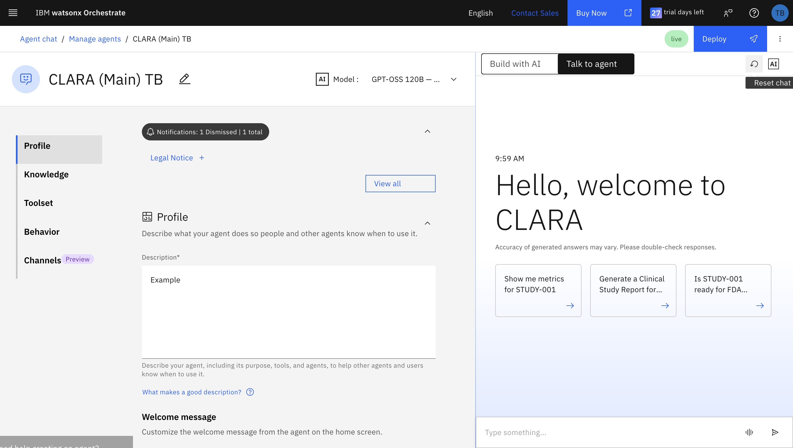

- Choose Agent style `ReAct`:

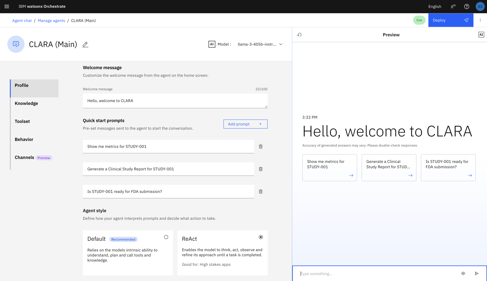

7. Navigate to Toolset section and click "Add agent"

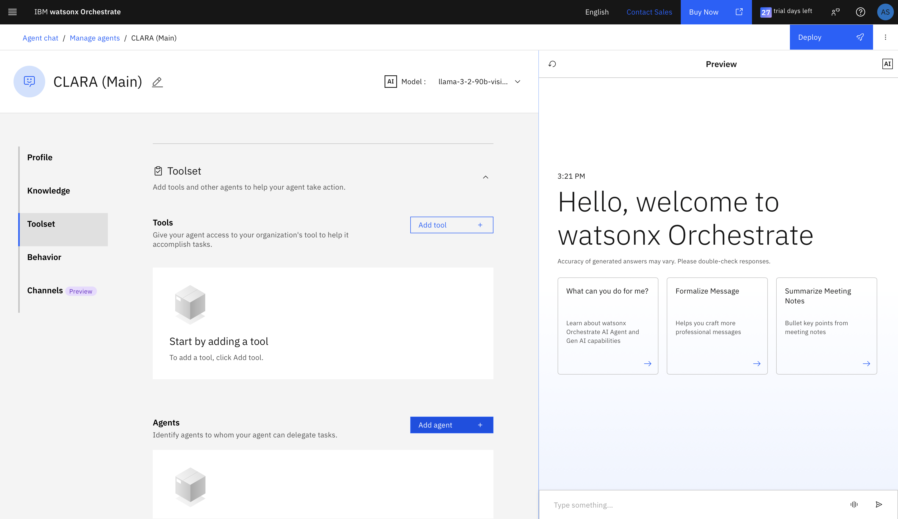

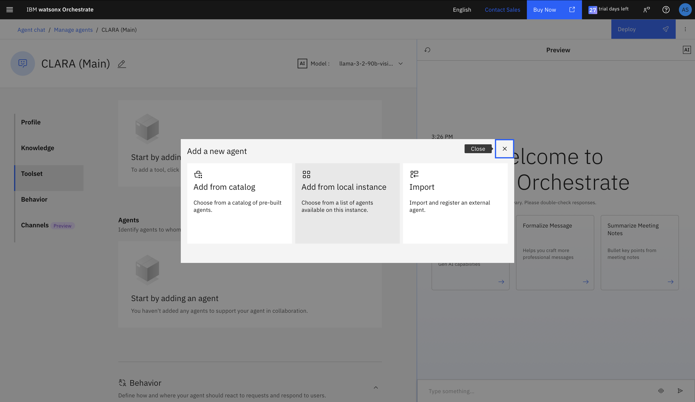

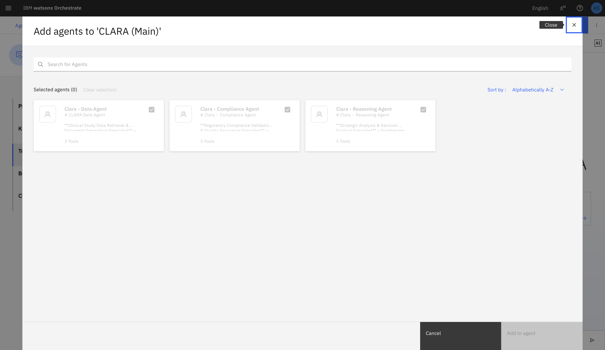

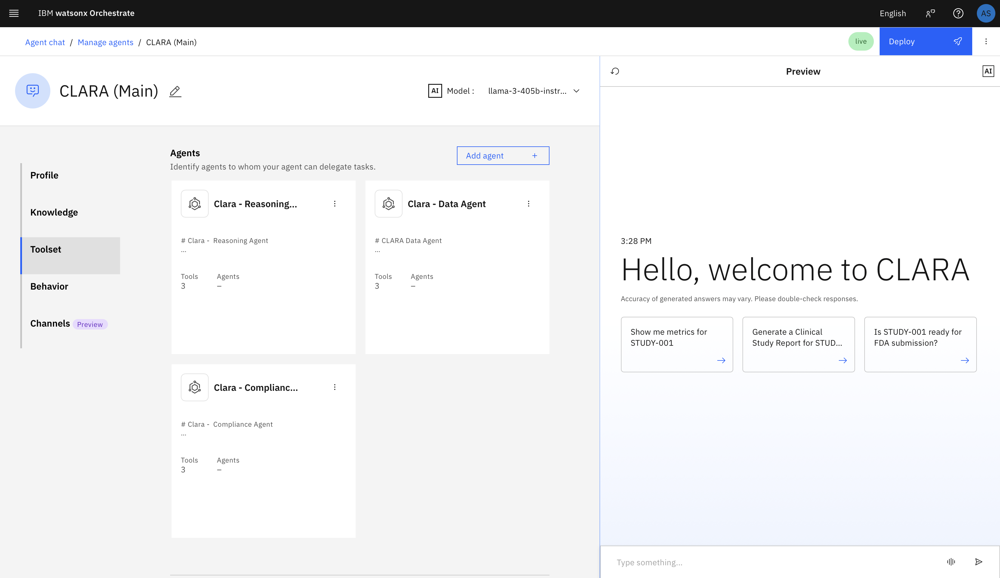

8. Agent Behavior

- This agent needs to be enabled for direct chat
- Enter the following Agent Instructions Behavior given in [Orchestrator Agent Behavior](./behavior/orchestrator_behavior.md)

9. Test the agent with a sample prompt: `Show me metrics for STUDY-001`

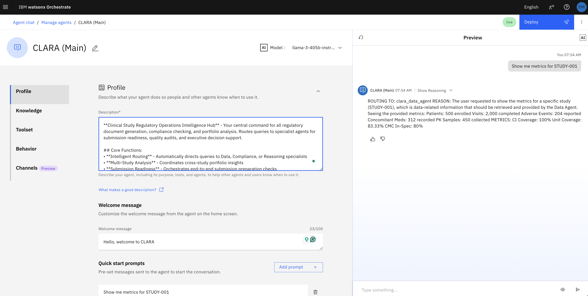

10. Click "Deploy" to publish the agent as Live

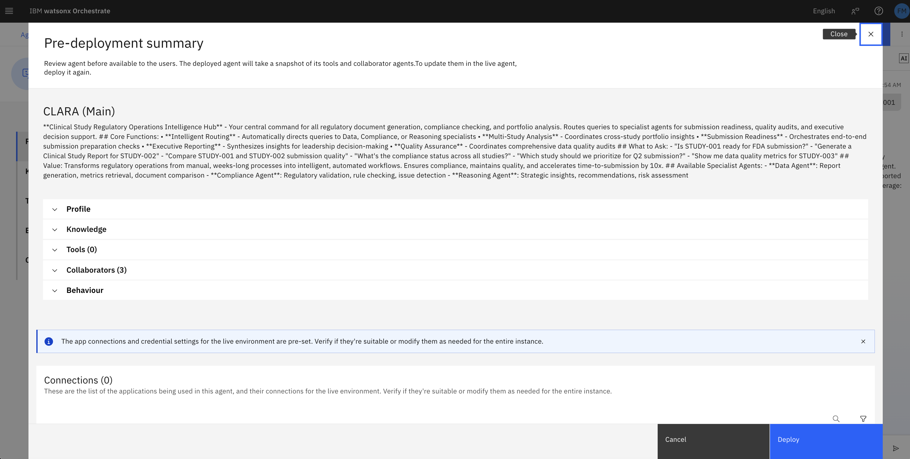

11. Press on the `hamburger menu` in the top left corner of the interface to open the main menu:

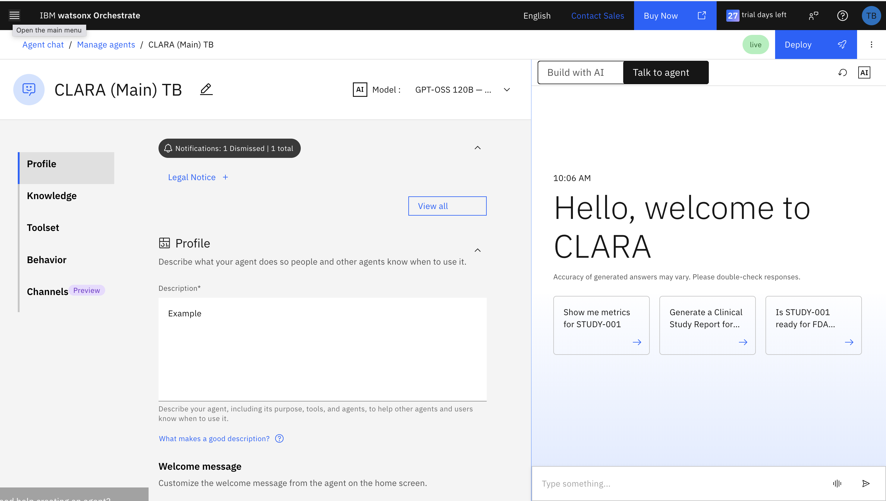

- Press `Chat`

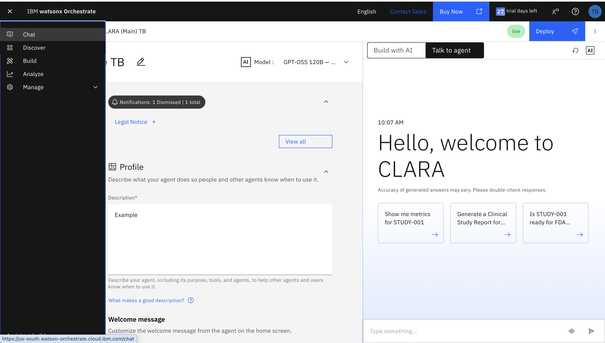

- Select your CLARA (Main) agent from the list. 

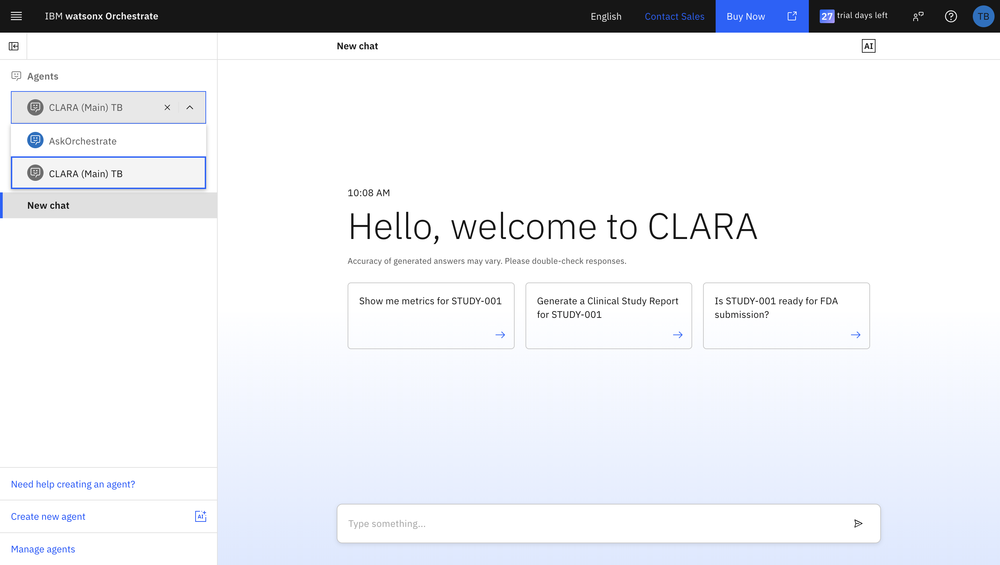


## Using the AI Agent

After deploying agents, use these prompts to test the complete flow:

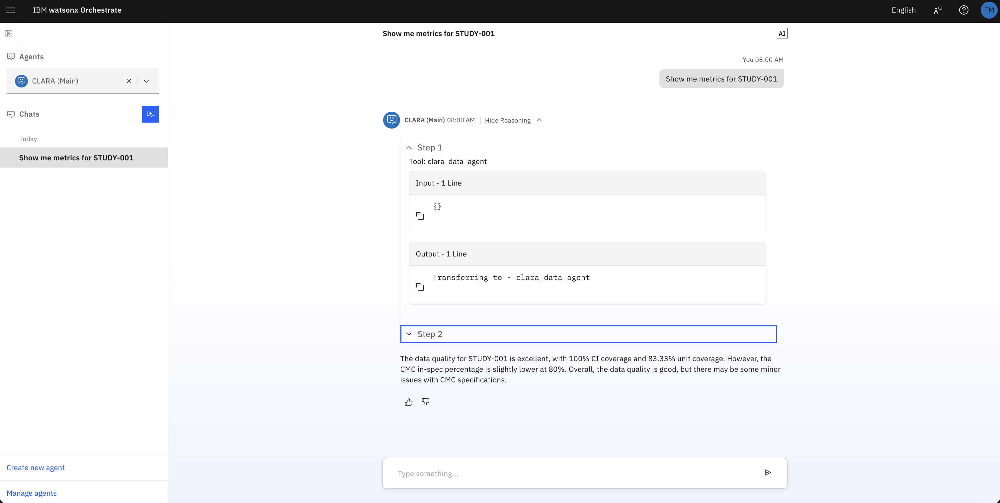

### Try other questions:

[Press "New chat" (blue icon on the side bar)]
1. Give me an executive summary of our portfolio
   - If asked about the study ID's type this: STUDY-001, STUDY-002, STUDY-003, STUDY-004, STUDY-005
2. Show me the metrics for STUDY-001
3. Show me the metrics for STUDY-003

[Press "New chat"]
1. Is STUDY-001 ready for FDA submission?
   - If asked "Could you please provide the compliance status of STUDY-001?" type: Don't have it, use a complaiance agent to get all this info
2. Why does STUDY-001 have better quality than STUDY-003?
3. Show me only the number of patients included int the STUDY-003

### Agentic AI Planning Canvas

Please continue to the [Agentic AI Canvas](./Agentic-AI-Canvas-empty.pdf) to plan your own agent.


